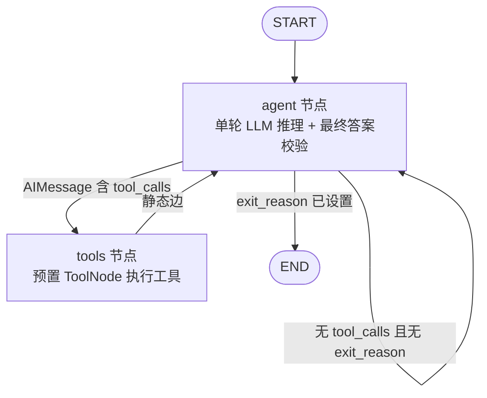

# gacore 架构说明 (Architecture)

本文档解释 gacore 的图拓扑、状态通道，以及每个关键设计决策"为什么这么做"。
阅读对象是正在学习 LangGraph 的读者：对照 GenericAgent（下称 GA）的
[`agent_loop.py`](https://github.com/lsdefine/GenericAgent/blob/main/agent_loop.py)，
看同一个 Agent 循环如何从手写 `while` 变成 StateGraph。

---

## 1. 图拓扑 (Graph Topology)

gacore 是一个 2 节点的有环图：唯一的业务节点 `agent` 加 langgraph 预置的
`ToolNode`（`tools`），`END` 是终结状态，`START` 是隐式入口。图上只有 1 条
条件边（挂在 agent 之后），`tools → agent` 是静态边。



流程（对照 GA `agent_loop.py` 的主循环）：

1. **agent**：做一轮 LLM 调用。进入时先做 max_turns 守卫，再拼提示词、
   `bind_tools` 后 `invoke`。返回的 AIMessage 可能带 `tool_calls`。
   **最终答案校验（GA 的 `no_tool` 分支 / `_done_hooks`）就在这个节点里完成**：
   空回答重试最多 3 次、`done_hooks` 非空则续接、否则正常收尾置
   `CURRENT_TASK_DONE`。
2. **条件边（`route_after_agent`）**：
   - `exit_reason` 已设置 → `END`（终止信号优先于一切）；
   - 最后一个消息是带 `tool_calls` 的 AIMessage → `tools`；
   - 否则（纯文本回答）→ 回 `agent` 继续下一轮。
3. **tools**：langgraph 预置 `ToolNode` 执行最后一条 AIMessage 里的全部
   `tool_calls`，每个调用对应一个 `ToolMessage`。需要写状态通道的工具
   （`ask_user` 的 `exit_reason`、`update_working_checkpoint` 的 `working`）
   返回 `Command(update=...)`，由 LangGraph 原生处理（见第 3 节决策 c）。
4. **静态边 `tools → agent`**：工具结果送回 agent 进入下一轮。

注意这里**故意不用 `goto`**：langgraph 1.2.10 里 `Command.goto` 是**追加**语义，
会把目标追加到现有边上，导致 `tools → agent` 和 `goto` 的目标叠加成死循环。
控制流完全由 agent 节点的条件边决定，工具只通过 `Command(update=...)` 改状态。

---

## 2. 状态通道 (State Channels)

`GAState`（`src/gacore/state.py`）是一个 TypedDict。只有 `messages` 配了
`add_messages` 归约器（追加语义），其余通道都用 LangGraph 的默认覆盖语义：
节点返回的最新值直接替换旧值，节点必须自己带全量写入。

| 通道 | 类型 | 归约器 | 语义 |
| :--- | :--- | :--- | :--- |
| `messages` | `list[BaseMessage]` | `add_messages`（追加） | 全量对话历史。LLM 的 AIMessage、工具结果 ToolMessage、校验注入的 HumanMessage 都按序追加 |
| `working` | `dict` | 覆盖 | 工作记忆。`update_working_checkpoint` 返回 `Command(update={"working": ...})` 写入 `key_info` / `related_sop` |
| `current_turn` | `int` | 覆盖 | 当前轮数，agent 节点自增（`state.current_turn + 1`） |
| `max_turns` | `int` | 覆盖 | 轮数上限，启动时由 `cfg.max_turns` 写入，agent 节点只读 |
| `done_hooks` | `list[str]` | 覆盖 | 收尾提示队列。agent 节点弹出第一条作为 HumanMessage，再把剩余列表写回 |
| `retry_count` | `int` | 覆盖 | 空回答的连续重试计数，agent 节点维护 |
| `exit_reason` | `str \| None` | 覆盖 | 终止原因。取值 `CURRENT_TASK_DONE` / `EXITED` / `MAX_TURNS_EXCEEDED` / `AGENT_ERROR`。一经设置，条件边就路由到 END |

关键观察：

- `messages` 是唯一的累积通道，天然对应 GA 里"历史在 Session 对象"的职责。
- `done_hooks` 没有归约器，所以 agent 节点必须写回完整剩余列表
  （`"done_hooks": done_hooks[1:]`），这是覆盖语义的典型写法。
- `exit_reason` 是整个图的"急停开关"：路由函数先查它，查到了就直接去 END，
  不依赖消息内容。

---

## 3. 关键设计决策 (Design Decisions)

### a. delta → full-history 迁移

**GA 的做法**（`agent_loop.py:104`）：

```python
messages = [{"role": "user", "content": next_prompt, "tool_results": tool_results}]  # just new message, history is kept in *Session
```

GA 每轮只把**新的一轮消息**发给 LLM（新的 user prompt + 本轮的 tool_results），
完整历史存放在 Session 对象里，由 `turn_end_callback` 负责把历史折叠成摘要注入。

**gacore 的做法**：LangGraph 没有"Session"概念，状态必须自包含。
所以 `state.messages` 持有**全量历史**，`add_messages` 负责追加；
每轮提示词由 `context.build_turn_prompt` 现场重建：一个全新构造的
`SystemMessage`（内含系统提示词 + 折叠后的历史摘要 + 周期提示），
再加上 `state.messages` 原样返回给 LLM。

**为什么这个迁移是安全的**：`SystemMessage` 从不写入 `state.messages`，
每轮都是"临时拼接、用完即弃"，所以不会被 `add_messages` 重复累积；
而真正的对话消息全量保留在状态里，折叠只发生在"送入 LLM 的提示词"这一层。
副作用是 token 成本比 GA 高（全量重发历史），换来的是状态自包含、可恢复、
可测试。这对一个学习项目是正确取舍。

### b. StepOutcome 映射

GA 的每个工具返回 `StepOutcome(data, next_prompt, should_exit)`，主循环据此决定走向
（`agent_loop.py:90-98`）：

```python
if outcome.should_exit:      # → EXITED
if not outcome.next_prompt:  # → CURRENT_TASK_DONE
next_prompts.add(outcome.next_prompt)  # 否则把下一段提示带回循环
```

gacore 把 `StepOutcome` 的三元语义拆进两个地方：

| GA `StepOutcome` 字段 | gacore 落点 |
| :--- | :--- |
| `should_exit = True` | `ask_user` 工具返回 `Command(update={"exit_reason": "EXITED", ...})` |
| `next_prompt` 为空（任务完成） | agent 节点的正常回答分支置 `exit_reason = "CURRENT_TASK_DONE"` |
| `next_prompt` 非空（继续干活） | 由 LLM 自己生成下一段内容；提示注入走系统提示词 / HumanMessage 通道 |

**为什么"何时算完成"的判定放在 agent 节点**：GA 里"任务完成"的信号来自工具
返回空 `next_prompt`；但模型不调工具、直接给纯文本回答时（GA 的 `no_tool`
伪调用），GA 语义是 `next_prompts` 为空则查 `_done_hooks`，没有 hook 就退出。
gacore 把这条"no_tool"路径的校验逻辑并进 agent 节点：正常回答 →
`CURRENT_TASK_DONE`，空回答 → 重试（最多 3 次）后 `EXITED`。这样"何时算完成"
的判定集中在一个可单测的节点里，也省掉了原先 final 节点的条件边。

### c. 为什么用预置 ToolNode + Command，而不是自定义工具节点

GA 的工具结果里带着**控制信号**：`ask_user` 的 `should_exit` 要写进
`exit_reason`，`update_working_checkpoint` 的 `key_info` 要写进 `working`。
早期实现写了一个自定义 `GAStatefulToolNode` 来做这件事（本项目的
`nodes/tools.py`）。重构后**改用 langgraph 预置 `ToolNode` + `Command`**：

- langgraph 的 `ToolNode` 自动处理工具调用的配对、错误转 `ToolMessage`、
  `interrupt` 传播，不需要手写；
- 需要写非消息通道的工具，直接返回 `Command(update={...})`，LangGraph 原生
  把 update 合并进状态（`nodes/tools.py` / `nodes/final.py` 因此整个删掉）；
- `tool_call_id` 用 `Annotated[str, InjectedToolCallId]` 注入，`Command.update`
  里的 `ToolMessage` 用它配对回原始调用（`_validate_tool_command` 会校验）。

这是"能使用 LangGraph 的地方就使用 LangGraph，不重复造轮子"原则的直接体现：
自定义节点只在"预置原语覆盖不了"的时候才写。

### d. interrupt 语义

GA 的 `ask_user` 是同步等待用户输入；LangGraph 的等价物是 `interrupt()`：

- `ask_user` 工具（`tools/ask_user.py`）调用 `interrupt({"question": ..., "options": ...})`，
  第一次调用即暂停图执行。
- 图必须用 `MemorySaver`（或其它检查点）编译，暂停时的状态才能被序列化保存；
  `build_graph` 默认就带一个 `MemorySaver`。
- 恢复时用 `Command(resume=answer)` 继续，`interrupt()` 的返回值就是用户的回答
  （cli.py 的 `_run_turn` 循环处理）。
- 回答落在 `{abort, exit, quit, stop, cancel}` 里时，`ask_user` 返回
  `Command(update={"exit_reason": "EXITED", ...})`，agent 节点顶部短路返回 `{}`
  （不再调 LLM），条件边据此直接去 END，整个图收尾。

**langgraph 1.2.10 的版本特性**：单个中断在 `graph.invoke` 返回的 dict 里以
`__interrupt__` 键出现，**不抛异常**；`cli.py` 同时兼容了旧行为（捕获
`GraphInterrupt` 并归一化成同样的 dict 形式），因为中断可能从工具调用内部
以两种表象浮出水面。这是"跟随 langgraph 版本行为走"的一个实例。

### e. 工具异常处理

预置 `ToolNode` 在 langgraph 1.2.10 里的默认 `handle_tool_errors` 是一个只把
`ToolInvocationError`（参数校验错误）转成错误 `ToolMessage`、**其它异常原样重抛**
的处理器。这与 GA 的行为不符：GA 里单个工具失败绝不炸掉整个图。所以
`build_graph` 显式传 `handle_tool_errors=True`，让**所有**工具异常都变成错误
`ToolMessage` 送回给 agent 继续循环。

`ask_user` 的 `interrupt` 是例外：它在 langgraph 内部以 `GraphBubbleUp` 传播，
`ToolNode` 对它有专门分支原样上抛，不会被错误处理器吞掉——这是预置节点
替我们正确处理的场景之一。

### f. recursion_limit

LangGraph 默认 `recursion_limit = 25`，对 Agent 循环太低了：一轮任务在图上
大约要跑 2 步（agent → tools，纯回答 1 步），40 轮就是 80 步，还没算
空回答重试和 done_hooks 续接。`graph.py` 提供

```python
suggested_recursion_limit(max_turns) -> max_turns * 2 + 50
```

2 倍覆盖每轮的典型步数，+50 给重试和续接留余量；`run_once` 和 REPL
默认用 `DEFAULT_RECURSION_LIMIT = 200`。碰到 `RecursionLimit` 报错时，
第一反应应该是查这里，而不是改图结构。

### g. _cfg 注入缝的限制

工具需要配置（`code_run` 要 asset/temp 目录、`start_long_term_update` 要
memory 目录），但 LangChain 的 `@tool` 会从函数签名生成 JSON schema：
**pydantic 会丢弃下划线开头的参数**。所以 `_cfg: Config | None = None`
能通过签名注入、但不会出现在工具 schema 里（LLM 永远看不到它）。

后果：生产运行时工具只能回退到 `Config.default()`（读进程环境变量），
无法在测试中按工具粒度注入临时目录。解决方式是测试用 `Config.for_tests(tmp_path)`
构造 Config，并通过 `GACORE_MEMORY_DIR` 等环境变量让它成为 `Config.default()`
的真实来源，或者直接 patch 工具模块的 `build_tool_list` / `_default_cfg`。
这是"用 LangChain 工具装饰器就要接受它的 schema 约束"的学费。

---

## 4. GA parity 核对 (Parity Check)

逐条对照 GA `agent_loop.py:42-107`（`agent_runner_loop`）与 gacore 实现。
`[忠实]` = 语义完整移植；`[简化]` = 行为有差异或裁剪。

| # | GA `agent_loop.py` | gacore 实现 | 判定 |
| :--- | :--- | :--- | :--- |
| 1 | :44-47 初始化 `messages=[system, user]` | `new_state` 造 `[HumanMessage(user_input)]`；系统提示词每轮现拼 | `[忠实]` 语义（system 不落历史，见 3a） |
| 2 | :48 `turn=0; handler.max_turns=max_turns` | `state.py` 初始化 `current_turn=0, max_turns=cfg.max_turns` | `[忠实]` |
| 3 | :50 `while turn < handler.max_turns` | agent 节点进入时 `if turn > max_turns → MAX_TURNS_EXCEEDED` | `[忠实]`（守卫提前到 LLM 调用之前，比 GA 更省一次调用） |
| 4 | :51 `turn += 1` | agent 节点 `current_turn = state.current_turn + 1` | `[忠实]` |
| 5 | :56 `if turn%10==0: client.last_tools=''` | 无对应（LangChain 每次 `bind_tools` 重建，无工具描述缓存） | `[简化]`（机制不存在，无需重置） |
| 6 | :59 `client.chat(messages, tools=tools_schema)` | `llm.bind_tools(...).invoke(build_turn_prompt(state, cfg))` | `[忠实]`（llmcore → llm.py） |
| 7 | :69 无 `tool_calls` → `no_tool` 伪调用 | agent 节点内联完成校验（空回答重试 / done_hooks / 收尾） | `[忠实]`（no_tool 分支并入 agent 节点） |
| 8 | :74-98 逐个 `dispatch` 工具 → `StepOutcome` | 预置 `ToolNode` 执行 `tool_calls`；控制信号经 `Command(update=...)` 回写 | `[忠实]` |
| 9 | :90 `outcome.should_exit` → `EXITED` | `ask_user` 返回 `Command(update={"exit_reason": "EXITED", ...})` | `[忠实]` |
| 10 | :92 `not outcome.next_prompt` → `CURRENT_TASK_DONE` | agent 节点正常回答 → `exit_reason="CURRENT_TASK_DONE"` | `[忠实]`（判定从工具结果移到 agent 节点，见 3b） |
| 11 | :95-97 `outcome.data` → `tool_results`（带 `tool_use_id`） | `ToolMessage(content=..., tool_call_id=call_id)` | `[忠实]`（LangChain 原生配对） |
| 12 | :99-101 `next_prompts` 为空且非 EXITED → 弹 `_done_hooks[0]` 续接 | agent 节点 done_hooks 分支：第一条 hook 转 HumanMessage 后继续循环 | `[忠实]`（`_done_hooks` 队列 → `done_hooks` 通道） |
| 13 | :102 `turn_end_callback(...)` 返回下一条 prompt | `context.build_turn_prompt`（纯函数）组装下一轮提示 | `[简化]`（见下） |
| 14 | :104 `messages = [新 user 消息]`，历史在 Session | `state.messages` 全量追加（`add_messages`） | `[简化]`（核心差异，见 3a） |
| 15 | :105 exit 后再调一次 `turn_end_callback` | 无对应（agent 节点已含校验） | `[简化]` |
| 16 | :107 `return exit_reason or MAX_TURNS_EXCEEDED` | `exit_reason` 通道 + agent 守卫兜底 | `[忠实]` |

### turn_end_callback 的核对（ga.py:570）

GA 的 `turn_end_callback` 做四件事，gacore 在 `context.py` 里的对应：

| GA `turn_end_callback` 职责 | gacore 对应 | 判定 |
| :--- | :--- | :--- |
| 从回复里提取 `<summary>`（`extract_summaries` 的正则同源） | `context.extract_summaries` | `[忠实]`（正则与协议一致） |
| 把 `[Agent] {summary}` 追加进 `history_info` 供下轮折叠 | 完整 AIMessage 已在 `state.messages`，无需摘要历史；折叠发生在送 LLM 前 | `[简化]`（GA 用摘要省 token，gacore 全量保留） |
| 周期提示：turn%10 记忆刷新、%13 打工作检查点、%31 写文件、%175 ask_user | `context.periodic_hints`（额外加 turn>100 反循环警告） | `[简化]`（触发点一致，文案简化；GA 的 plan 模式提示、master 注入未移植） |
| `get_global_memory`（读 L1 洞察索引拼提示） | 折叠历史 + `build_system_prompt` 的 working checkpoint | `[简化]`（不读 `insight_fixed_structure` 模板） |

### LLM 异常处理（gacore 新增）

GA 没有显式处理 LLM 调用异常；gacore 的 agent 节点捕获后记 JSONL 错误日志，
返回带 `[Agent error: ...]` 说明的 AIMessage，并以 `exit_reason="AGENT_ERROR"`
干净退出（`nodes/agent.py`）。这是有意的偏差：学习项目优先可测试、
可诊断的终态，而不是让图硬崩溃或无限重试。

---

## 5. 简化与未移植项 (Simplifications)

- **全量历史 vs 增量消息**：3a，最大的结构性差异，token 成本换状态自包含。
- **LLM 异常**：GA 无处理，gacore 以 `AGENT_ERROR` 干净退出。
- **空回答重试**：agent 节点内联实现（GA 只有空回答的 `_retry_or_exit` 规则；
  早期版本针对 provider `finish_reason` 的**截断续写检测已删除**——不同 provider
  的 `finish_reason` 行为不一致，判据不可靠，移除后空回答重试仍保留）。
- **master 注入 / 干预通道**：GA 的 `_keyinfo` / `_intervene` 文件注入、plan 模式
  提示、`_turn_end_hooks` 全部未移植。
- **`client.last_tools` 重置**：GA 每 10 轮清空工具描述缓存以省 token，机制不存在，跳过。
- **未移植模块**：reflect 自治模式、插件 hooks、IM 前端、L4 归档、
  Mixin 多模型切换、TMWebDriver 真实浏览器（见 README 范围说明）。
