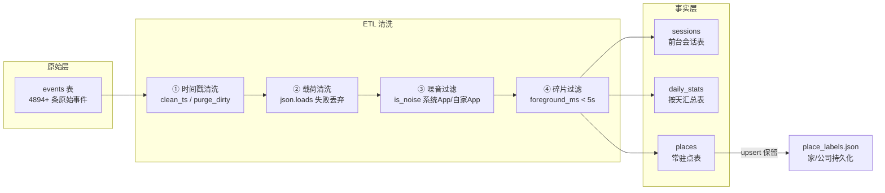
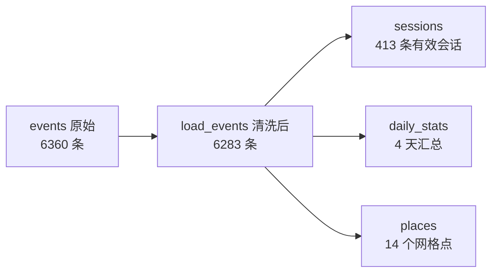
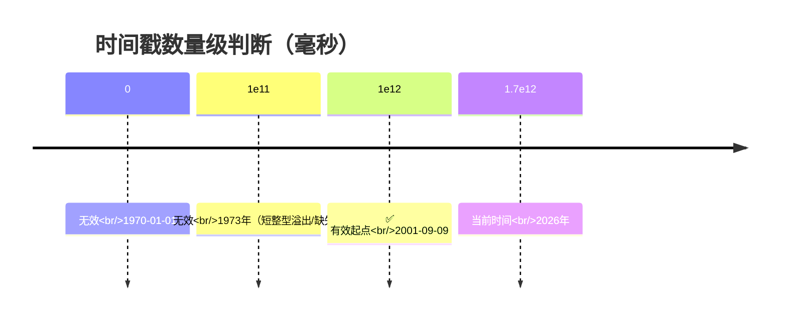
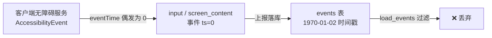
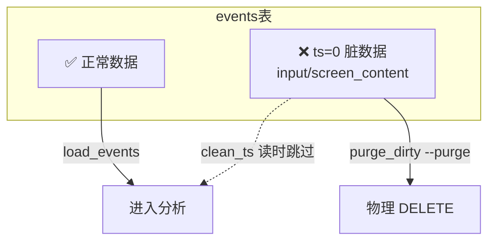
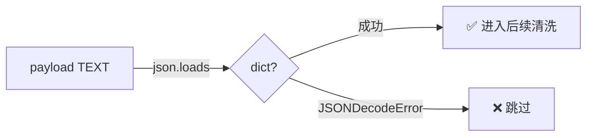
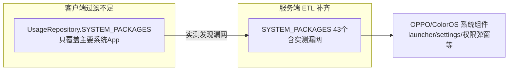
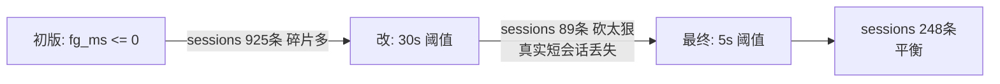
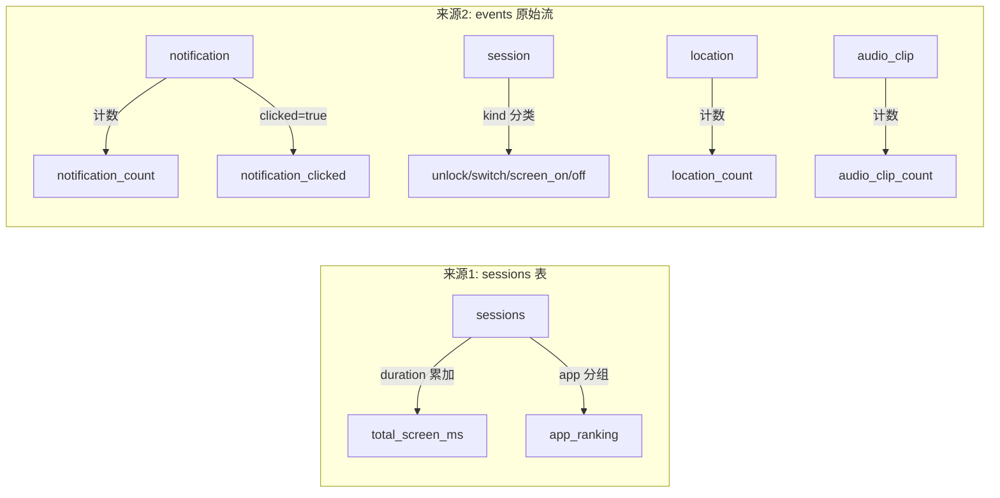
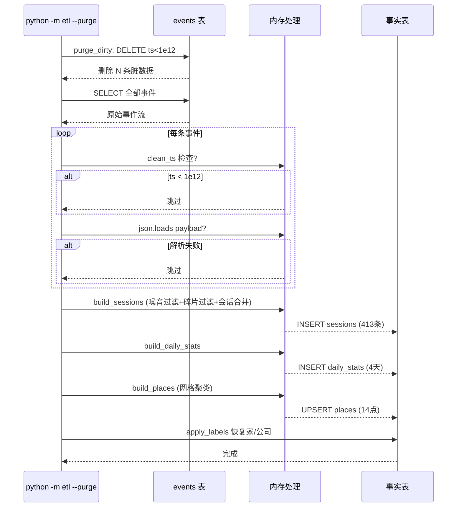

# weiTrack ETL 数据清洗详解

> 对应代码：`src/gacore/weitrack/etl.py`
> 本文档逐条对应代码实现，讲清楚"每一条脏数据从哪来、为什么被清、清了之后数据变成什么样"。

---

## 1. 总体数据流

原始事件流（`events` 表）经过 ETL 三道工序，产出三张事实表：



**数据量变化（实测 8-18 全量重跑）：**



---

## 2. 第一道：时间戳清洗（`clean_ts` / `purge_dirty`）

### 2.1 读事件时过滤（`load_events` → `clean_ts`）

```python
# etl.py:121-123
def clean_ts(ts: int) -> bool:
    """时间戳有效性：毫秒级且不为 0/负（过滤无障碍偶发脏数据）。"""
    return ts > 1_000_000_000_000
```

**阈值 `1_000_000_000_000`（1e12）是什么概念：**



**为什么会有 `ts < 1e12` 的数据？**



**实测影响**（8-17 清理）：`purge_dirty` 从 events 表物理删除 **948+77 条** ts 脏数据，全部来自 `input`（199）和 `screen_content`（736+）——**无障碍事件 timeStamp=0 是脏数据唯一来源**。

### 2.2 物理删除（`purge_dirty`，`--purge` 触发）

```python
# etl.py:268-284
def purge_dirty(db_path: Path) -> None:
    conn = sqlite3.connect(db_path)
    c1 = conn.execute("DELETE FROM events WHERE ts < 1000000000000")
    # payload 非 JSON 的（防御）
    rows = conn.execute("SELECT id, payload FROM events").fetchall()
    bad_ids = []
    for eid, raw in rows:
        try:
            json.loads(raw)
        except (json.JSONDecodeError, TypeError):
            bad_ids.append(eid)
    if bad_ids:
        conn.executemany("DELETE FROM events WHERE id=?", [(i,) for i in bad_ids])
```

**两种清理的区别：**

| 方式 | 位置 | 作用 | 触发 |
|---|---|---|---|
| `clean_ts` | 读时过滤（`load_events`） | 分析时跳过脏数据，**不删原表** | 每次 ETL 自动 |
| `purge_dirty` | 物理删除 events 表 | 彻底清掉脏数据，防止反复分析 | `--purge` 手动 |



---

## 3. 第二道：载荷清洗（`json.loads`）

```python
# etl.py:133-136
try:
    payload = json.loads(payload_raw)
except json.JSONDecodeError:
    continue
```

**原理**：`events.payload` 列存的是 JSON 字符串（`storage.py` 入库时 `json.dumps`）。读出来必须能 parse 成 dict，否则跳过。



**现状**：实测 0 条 payload 解析失败（客户端 `JSONObject.toString()` 保证格式），这是防御性代码——防止未来采集端 bug 或手动改库引入坏数据。

---

## 4. 第三道：噪音过滤（`is_noise`）

```python
# etl.py:147-148
def is_noise(pkg: str) -> bool:
    return pkg in SYSTEM_PACKAGES or pkg in OWN_PACKAGES
```

### 4.1 系统 App 黑名单（`SYSTEM_PACKAGES`，43 个包名）

```python
# etl.py:24-69（节选关键几条）
SYSTEM_PACKAGES = {
    "android",
    "com.android.systemui",
    "com.android.launcher3",
    "com.android.launcher",  # OPPO/ColorOS 实际桌面包名（实测漏网）
    ...
    "com.android.settings",
    "com.oplus.settings",
    ...
    # 实测系统组件
    "com.android.permissioncontroller",
    "com.oplus.securitypermission",
    ...
}
```

**为什么这份黑名单这么长且"杂"？**



**漏网案例（实测抓到）：**

| 包名 | 用途 | 为何漏 |
|---|---|---|
| `com.android.launcher` | OPPO 实际桌面 | 客户端只写了 `launcher3`/`oplus.launcher`，**漏了裸 `launcher`** |
| `com.android.permissioncontroller` | 权限弹窗 | 全新系统组件，客户端黑名单没有 |
| `com.oplus.securitypermission` | OPPO 安全中心 | 厂商定制组件 |

**实测效果**：加入黑名单后，`sessions` 从 925 → 422（第一天），"系统桌面 43min/417 次"从排行消失。

### 4.2 自家 App 过滤（`OWN_PACKAGES`）

```python
# etl.py:71
OWN_PACKAGES = {"com.wei.checkapp"}
```

**为什么要过滤自家 App**：`weiCheckApp` 自己也在前台运行（用户打开 App 看数据），UsageStats 会把它记成前台会话。如果不滤：

```mermaid
flowchart LR
    A[用户打开用机时长 App 查看] --> B[UsageStats 记录<br/>com.wei.checkapp 前台]
    B -->|不过滤| C[❌ App排行出现"用机时长 56min 排第2"]
    B -->|is_noise 过滤| D[✅ 排除]
```

**实测**：第一天未过滤时"用机时长 56min（53次）"排第二，过滤后消失。

---

## 5. 第四道：碎片过滤（`foreground_ms < 5s`）

```python
# etl.py:174-176
# 丢弃 ≤5 秒碎片会话（实测大量 0-5 秒的系统/切换噪音）
if fg_ms < 5_000:
    continue
```

**碎片是什么**：切 App 时的瞬间前台、系统弹窗一闪而过、点按返回的极短停留——这些 `foreground_ms` 只有几百毫秒到几秒。

**阈值演进（实测驱动）：**



| 阈值 | sessions 数 | 问题 |
|---|---|---|
| `<= 0` | 925 | 0-5s 碎片全进，总时长虚高 |
| `< 30s` | 89 | 5-30s 真实使用（快速回消息）被砍 |
| `< 5s`（当前） | 248 | 平衡 |

**典型碎片样例（实测）：**
```json
{"pkg": "com.tencent.android.marvis", "app": "Marvis", "foreground_ms": 0, ...}   ← 0ms 丢弃
{"pkg": "com.coloros.alarmclock", "app": "时钟", "foreground_ms": 800, ...}      ← 0.8s 丢弃
{"pkg": "com.ss.android.ugc.aweme", "app": "抖音", "foreground_ms": 300000, ...} ← 5min 保留
```

---

## 6. 会话拼接（`build_sessions`）

清洗后的事件进入会话构建——**把零散的 usage 事件拼成有意义的"前台会话"**。

### 6.1 算法逻辑

```python
# etl.py:151-192（核心逻辑）
cur = None  # 当前会话 (pkg, app, activity, start_ms, end_ms, dur)
for ts, type_, p in evs:        # 按设备分组、按时间排序后遍历
    if type_ == "usage":
        ...
        # 同 app 连续 → 合并（end 取 max，时长累加）
        if cur and cur[0] == pkg and abs(ts - cur[4]) < 2 * 60_000:
            cur = (cur[0], cur[1], cur[2], cur[3], max(cur[4], end_ms), cur[5] + fg_ms)
        else:
            if cur: sessions.append(...)   # 关闭上一个
            cur = (pkg, app, activity, ts, end_ms, fg_ms)
    elif type_ == "session" and cur is not None:
        if kind in ("app_switch", "screen_off"):
            sessions.append(...)           # 边界事件 → 关闭当前会话
            cur = None
```

### 6.2 合并规则图解

```mermaid
flowchart TB
    subgraph 输入事件流（时间排序）
        U1["usage 微信<br/>08:00-08:05"]
        U2["usage 微信<br/>08:06-08:08<br/>(间隔<2min)"]
        U3["session app_switch<br/>08:08"]
        U4["usage 抖音<br/>08:08-08:15"]
    end

    subgraph 合并后会话
        S1["会话1: 微信<br/>08:00-08:08<br/>duration = 5min+2min = 7min"]
        S2["会话2: 抖音<br/>08:08-08:15"]
    end

    U1 --> 合并
    U2 --> 合并
    U3 -->|app_switch 边界| 断开
    U4 --> S2

    合并 --> S1
    断开 --> S2
```

**关键合并条件**（代码第 179 行）：
```
cur[0] == pkg                              ← 同一个 app
abs(ts - cur[4]) < 2 * 60_000              ← 间隔 < 2 分钟（2 分钟内回来算连续）
```

**边界事件**（代码 187 行）：
- `app_switch` → 用户切到别的 App，当前会话结束
- `screen_off` → 息屏，当前会话结束

### 6.3 会话表结构

```sql
-- etl.py:74-86
CREATE TABLE sessions (
  id INTEGER PRIMARY KEY AUTOINCREMENT,
  device_id TEXT, day TEXT,
  pkg TEXT, app TEXT, activity TEXT,      -- activity 是页面级信息
  start_ms INTEGER, end_ms INTEGER, duration_ms INTEGER
);
CREATE INDEX idx_sessions_day ON sessions(day);    -- 按天查询快
CREATE INDEX idx_sessions_pkg ON sessions(pkg);    -- 按 App 查询快
```

---

## 7. 按天汇总（`build_daily_stats`）

### 7.1 汇总维度

```python
# etl.py:197-229
stats[day] = {
    "total_screen_ms": 0,        # 总屏幕时长（来自 sessions 累加）
    "app_usage": defaultdict(int),# 各 app 时长
    "notif_count": 0,            # 通知总数
    "notif_clicked": 0,          # 点击数
    "notif_apps": defaultdict(int),# 各 app 通知量
    "screen_on": 0, "screen_off": 0, "unlock": 0, "switch": 0,
    "location": 0, "audio_clip": 0,
}
```

### 7.2 数据来源分两条路径



### 7.3 聚合与 Top-N

```python
# etl.py:233-242
top_apps = sorted(s["app_usage"].items(), key=lambda kv: -kv[1])[:10]   # 前10
top_notif = sorted(s["notif_apps"].items(), key=lambda kv: -kv[1])[:5]  # 前5
```

**存储格式**：Top-N 以 JSON 数组存在列里（不是单独表），方便 report/dashboard 直接读：

```sql
-- daily_stats.app_ranking_json 示例
[{"app": "微信", "ms": 1920000}, {"app": "飞书", "ms": 1860000}, ...]
```

---

## 8. 常驻点聚类（`build_places`）

### 8.1 网格聚类算法

```python
# etl.py:246-265
for _, ts, type_, p in events:
    if type_ != "location": continue
    ...
    gk = (round(lat * 1000) / 1000, round(lon * 1000) / 1000)  # 0.001° ≈ 110m 网格
    cell = grid.setdefault(gk, {...})
    cell["n"] += 1
```

**为什么不用 DBSCAN**（文档 P2 原方案）：
- 自用单设备，一天几十条定位，聚集在 2-3 个点
- 网格聚类 O(n) 一次遍历搞定，DBSCAN 需要距离矩阵
- 效果等价：网格单元（~110m）就是天然聚类半径

```mermaid
flowchart LR
    subgraph 定位点分布
        X1["(31.9750,118.7671) ×87次"]
        X2["(31.9928,118.7829) ×46次"]
        X3["(31.9749,118.7678) ×3次"]
        X4["(31.9910,118.7819) ×3次"]
    end
    X1 -->|round(lat*1000)/1000| G1["grid_key: 31.975,118.767"]
    X2 -->|round| G2["grid_key: 31.993,118.783"]
    X3 --> G3["31.975,118.768"]
    X4 --> G4["31.991,118.782"]
    G1 -->|visit_count=87 主点| P1["label=公司<br/>(新华汇)"]
    G2 -->|visit_count=46 主点| P2["label=家<br/>(雨花街道)"]
```

### 8.2 标签持久化（关键设计）

```python
# etl.py:320-333  upsert 保留标签
INSERT INTO places(...) VALUES (...)
ON CONFLICT(device_id, grid_key) DO UPDATE SET
  lat=excluded.lat, lon=excluded.lon,
  first_seen=MIN(places.first_seen, excluded.first_seen),
  last_seen=MAX(places.last_seen, excluded.last_seen),
  visit_count=places.visit_count + excluded.visit_count
```

```python
# etl.py:346-352  重跑后恢复持久化标签
from gacore.weitrack.label_places import apply_labels
n = apply_labels(db_path)
```

```mermaid
flowchart TB
    subgraph 用户确认一次
        U[python -m label_places<br/>输入 家/公司] -->|写| CFG[place_labels.json<br/>{"31.975,118.767": "公司", ...}]
    end
    subgraph ETL 每次重跑
        E[build_places] -->|upsert 不覆盖| P[places 表<br/>label 保持]
        E -->|apply_labels| CFG
        CFG -->|恢复标签| P
    end
    P -->|report/dashboard| R[场景分布: 公司 264次 / 家 156次]
```

---

## 9. 清洗流水线总览（一次 `--purge` 全流程）



---

## 10. 清洗规则速查表

| # | 规则 | 代码位置 | 触发 | 实测效果 |
|---|---|---|---|---|
| 1 | `ts < 1e12` 丢弃 | `clean_ts` | 每次 ETL | 过滤 948+77 条 ts=0 脏数据 |
| 2 | payload 非 JSON 丢弃 | `load_events` | 每次 ETL | 0 条（防御） |
| 3 | 系统 App 43 个过滤 | `is_noise` | sessions 构建 | "系统桌面"等噪音消失 |
| 4 | 自家 App 过滤 | `is_noise` | sessions 构建 | "用机时长"不再进排行 |
| 5 | `fg_ms < 5s` 丢弃 | `build_sessions` | sessions 构建 | 碎片消失，248 条有效会话 |
| 6 | 同 app 间隔<2min 合并 | `build_sessions` | sessions 构建 | 连续使用段合并 |
| 7 | app_switch/screen_off 断会话 | `build_sessions` | sessions 构建 | 会话边界正确 |
| 8 | 位置网格 0.001° 聚类 | `build_places` | places 构建 | 14 网格点，2 主点 |
| 9 | 标签 upsert 保留 + 持久化恢复 | `run` / `apply_labels` | 每次 ETL | 家/公司不随重跑丢失 |

---

## 11. 已知限制（诚实说明）

1. **脏数据根因未除**：`purge_dirty` 是治标，客户端 `AccessibilityEvent timeStamp=0` 仍在产生新脏数据（路书 R7 待办）——**根治要改客户端**：`eventTime <= 0` 时用 `System.currentTimeMillis()` 兜底。
2. **app_switch 切换数偏多**：603 次/天偏高，会话拼接按 usage 事件粒度，OPPO 上系统组件切换频繁，即使过滤噪音仍可能虚高。
3. **places 标签自动推断弱**：关键词规则（"大厦/小区"）对"新华汇 B1 座"这类真实地名误判，目前依赖用户一次确认 + 持久化。
4. **ETL 全量重建**：sessions/daily_stats 每次 DELETE 重建（简单可靠），数据量大后（>100 天）需要改增量。
