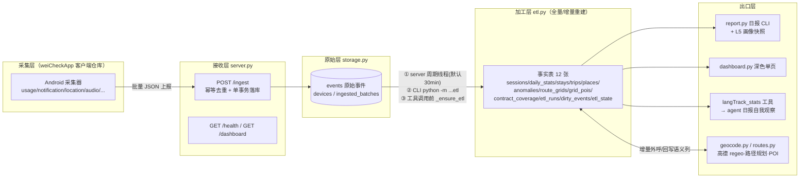
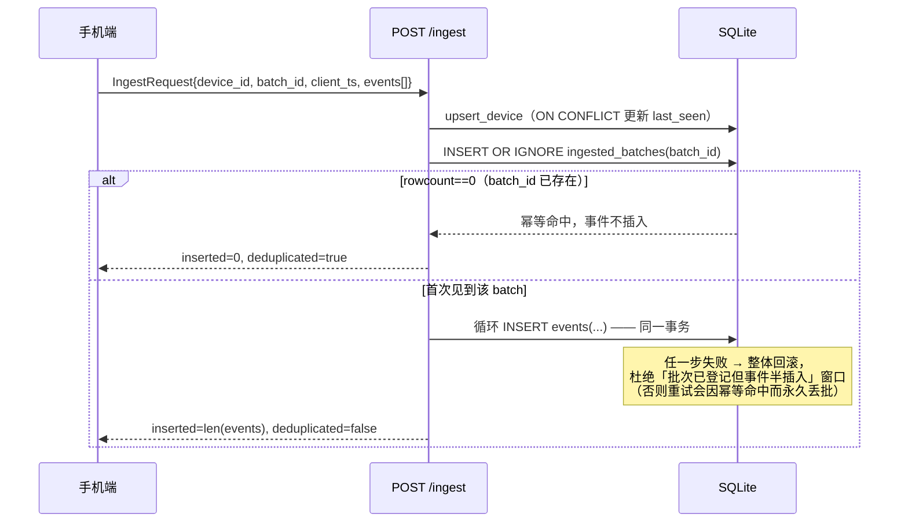
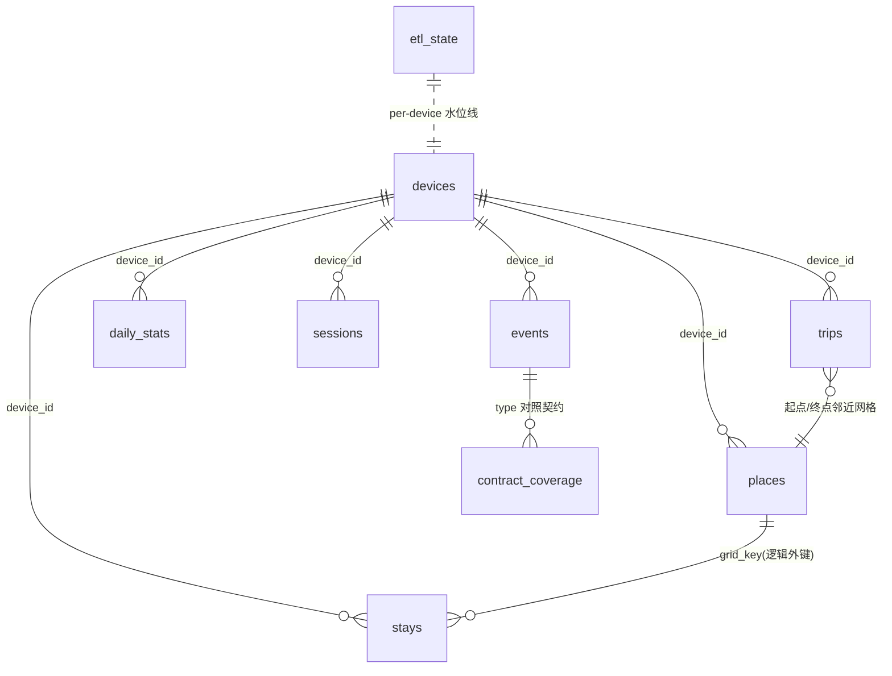
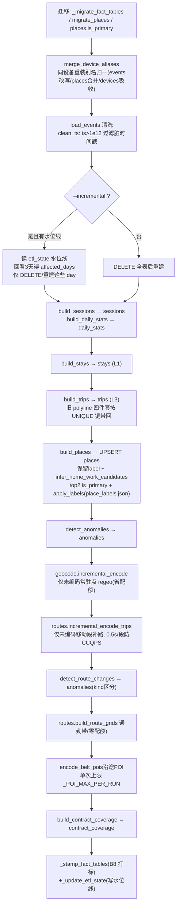
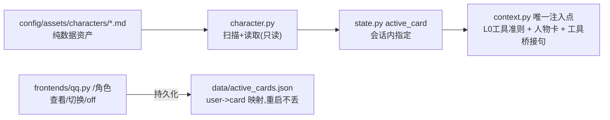
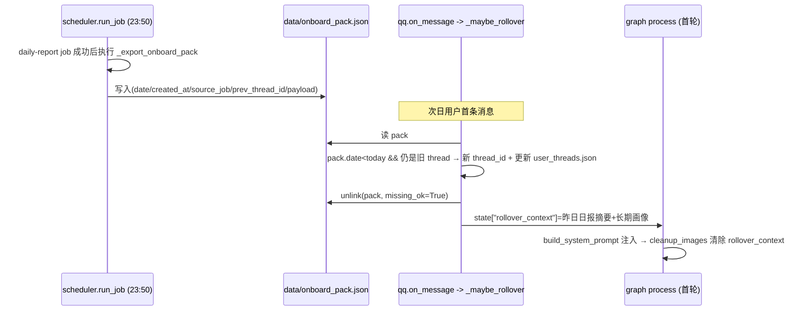

# langTrack 技术实现参考（接口 · 实体 · 数据库 · 数据流）

> 本文是 langTrack 服务端的**代码级技术参考**，所有字段/接口/阈值均对照源码（标注 `文件:行号`）。
> 配套文档：数据链路总览与工作日志见 [`langTrack-roadmap.md`](langTrack-roadmap.md)；ETL 清洗规则细节见 [`etl-cleaning-guide.md`](etl-cleaning-guide.md)。
> 生成日期：2026-08-22，基于 ETL_VERSION `1.0.0`（`etl.py:159`）。

---

## 1. 端到端数据流总览



**分层职责一句话**：客户端只采集上报；服务端 `/ingest` 只做"校验+幂等落库"；`etl.py` 把原始 events 加工成事实表；出口层全部**只读事实表**，不反向写采集数据。

---

## 2. HTTP 接口（`server.py:76-107`）

| 方法 | 路径 | 参数 | 响应 | 说明 |
|---|---|---|---|---|
| GET | `/health` | — | `{"status":"ok"}` | 存活探针 |
| POST | `/ingest` | body=`IngestRequest` | `{"status":"ok","inserted":N,"deduplicated":bool}` | 幂等：`batch_id` 重复时返回 `{"status":"ok","inserted":0,"deduplicated":true}` |
| GET | `/dashboard` | `?day=YYYY-MM-DD`（可选） | `text/html` | 深色单页仪表盘，调 `render_dashboard_html(conn, day)`（`dashboard.py:237`），每次请求新开只读连接 |

### 2.1 幂等与事务语义（`storage.ingest_batch`, storage.py:89-115）



关键点：
- `type` **不做枚举限制**（`schemas.py:1-3`）：客户端持续扩展新类型，服务端按 JSON 原文落库，分析层自行区分——契约符合性由 A① 的 `contract_coverage` 表事后校验，而非入库拦截。
- 后台周期 ETL：FastAPI lifespan 起 daemon 线程（`server.py:61-73`），间隔 `LANGTRACK_ETL_INTERVAL_SECONDS`（默认 1800s）、单次超时 `LANGTRACK_ETL_TIMEOUT_SECONDS`（默认 120s）；以 `subprocess` 方式跑 `python -m gacore.langTrack.etl`，失败仅记日志**不阻塞接收**。

### 2.2 启动方式

```powershell
$env:PYTHONPATH = "src"
python -m gacore.langTrack --host 0.0.0.0 --port 8000 --db langTrack.db
```

---

## 3. 请求实体（`schemas.py`）

```python
class Event(BaseModel):
    type: str      # 自由字符串，见 §2.1 关键点
    ts: int        # 毫秒时间戳（客户端时钟）
    data: dict     # 事件原文，服务端不深校验

class IngestRequest(BaseModel):
    device_id: str
    batch_id: str   # 客户端生成的批次号 = 幂等键
    client_ts: int
    events: list[Event]
```

上报示例：

```json
{
  "device_id": "c2b6198c-e879-4bad-aee7-98d227dc9852",
  "batch_id": "b-20260822-001",
  "client_ts": 1755800000000,
  "events": [
    {"type": "session", "ts": 1755800001000,
     "data": {"screen_on": 1, "unlock": 0, "switch": 2}}
  ]
}
```

---

## 4. 数据库表字典

SQLite 单库 `data/langTrack.db`（gitignore）。分两层：**原始层**只追加不改写；**事实层**随 ETL 可重建（除人工标注外）。

### 4.1 原始层（`storage.py _SCHEMA`, L8-34）

#### devices — 设备登记

| 字段 | 类型 | 用途 |
|---|---|---|
| device_id | TEXT PK | 设备唯一标识 |
| first_seen / last_seen | INTEGER | 首次/最近上报毫秒时间戳；`upsert_device` ON CONFLICT 刷新 last_seen |

#### ingested_batches — 批次账本（幂等的根基）

| 字段 | 类型 | 用途 |
|---|---|---|
| batch_id | TEXT PK | 客户端批次号；重复即判重 |
| device_id / received_at | TEXT / INTEGER | 归属设备 / 服务端收到时刻(ms) |

#### events — 原始事件（唯一事实来源，ETL 的输入）

| 字段 | 类型 | 用途 |
|---|---|---|
| id | INTEGER PK AUTOINCREMENT | 行号 |
| device_id / ts / type | TEXT / INTEGER / TEXT NOT NULL | 设备 / 毫秒时间戳 / 事件类型（自由串） |
| **payload** | TEXT NOT NULL | **JSON 原文字符串**。注意列名是 `payload` 不是 `data`（历史踩坑 #2，写 SQL 前先 PRAGMA 确认） |
| received_at | INTEGER | 服务端接收时刻(ms)，区别于客户端 `ts` |

索引：`idx_events_device_ts(device_id, ts)`。

旧库迁移：`_add_timestamp_columns`（storage.py:37-59）对三张表补 `created_at/updated_at` 并用各自业务时间列回填东八区可读时间。

### 4.2 事实层（`etl.py _SCHEMA`, L163-516）

公共约定：事实表带 `etl_version` + `created_at`/`updated_at`（东八区），由 B8 `_stamp_fact_tables`（etl.py:1136）统一打标，其自然时间列映射：

| 表 | 自然时间列 | 表 | 自然时间列 |
|---|---|---|---|
| sessions | start_ms | places | first_seen |
| stays / trips | start_ts | anomalies | ts |
| daily_stats / route_grids | day（非毫秒） | grid_pois | queried_at |

#### sessions — 前台 App 会话（B 重建核心表）

| 字段 | 用途 |
|---|---|
| device_id, day | 设备 + 东八区归属日 |
| pkg, app, activity | 包名 / 显示名 / Activity |
| start_ms, end_ms, duration_ms | 会话起止与时长 |

索引 `idx_sessions_day/pkg`；构建函数 `build_sessions(events)`。

#### daily_stats — 天粒度聚合（画像主输入）

PK `(device_id, day)`（B2 修正；`device_id DEFAULT 'unknown'` 兼容旧库行）。

| 字段 | 用途 |
|---|---|
| total_screen_ms | 当日屏幕总时长（persona 屏幕健康度、report 屏幕节的来源） |
| app_ranking_json | App 时长排行 JSON 数组 `[{"app","ms"},...]`（persona 分类聚合逐条消费） |
| notification_count / notification_clicked | 通知数 / 点击数 |
| top_notification_apps_json | 通知 Top 应用 |
| screen_on/off_count, unlock_count, switch_count | 亮灭屏 / 解锁 / 切换次数 |
| location_count, audio_clip_count | 定位点数 / 音频片段数 |

#### stays — L1 停驻点

`build_stays(events)` 产出；索引 day/device。

| 字段 | 用途 |
|---|---|
| start_ts, end_ts, duration_ms | 停驻起止 |
| center_lat/lon, min/max_lat/lon | 中心与包围盒 |
| n_points, radius_m | 参与点数 / 弥散半径 |
| grid_key | 网格键 = 与 places 关联的外键（逻辑外键） |
| day | 东八区归属日（`_TZ_CST` 显式时区归日） |

#### trips — L3 移动段（相邻停驻点之间的 gap）

`routes.build_trips(events, stays)`（routes.py:64-130）：双阈值过滤 `duration ≥ TRIP_MIN_DURATION_MS(60s)` 且 haversine 距离 `≥ TRIP_MIN_DIST_M(300m)`；无采样点用前后停驻中心兜底。

| 字段 | 用途 |
|---|---|
| 起止/距离组 | start/end_ts, duration_ms, start/end_lat/lon, dist_m, n_points, day |
| polyline, route_key, route_mode, route_encoded_at | 高德路径规划结果缓存四件套；ETL 全量重建时按 `UNIQUE(device_id,start_ts,end_ts)` 带回旧值，**避免重复烧配额**（etl.py:1285-1309） |

#### places — 常驻点（唯一"半人工"状态的事实表）

UPSERT 保标签：`ON CONFLICT(device_id, grid_key)` 只更新统计并保留 label（etl.py:1312-1326）；人工确认的「家/公司」持久化在 `data/place_labels.json`，每次 ETL 末尾 `apply_labels` 恢复（踩坑 #4 的解法）。

| 字段 | 用途 |
|---|---|
| grid_key, lat/lon, first_seen, last_seen, visit_count | 网格身份与到访统计 |
| label | 家 / 公司 / 未知（用户确认值，ETL 不覆盖） |
| is_primary | 自动标记 top2 主常驻点 |
| address, poi, district, township, business_area, poi_type | L2 regeo 语义回填 |
| poi_l1/l2/l3, poi_signal, poi_fallback, matched_level | P1-2 POI 三级语义（大类;中类;细类）+ 名称硬信号 + 无 POI 兜底描述 |
| behavior | 行为语义 |
| candidate_label, confidence_home/work | L1 家/公司**置信度候选**（未确认前不污染 label） |
| geocoded_at | 最近一次 regeo 编码时刻（增量编码依据） |

#### contract_coverage — A① 契约覆盖校验

`build_contract_coverage(conn)`（etl.py:980-1036）全量重建：`SELECT type,COUNT(*),MAX(ts) FROM events GROUP BY type` 对照 `contract.EXPECTED_EVENT_TYPES`。

| 字段 | 用途 |
|---|---|
| type | PK，事件类型 |
| expected / consumed / desc | 是否期望(1) / ETL 消费度(true·partial·false，仅展示) / 中文说明 |
| arrived / event_count / last_seen_ts | 是否到达 / 到达次数 / 最近到达时刻 |
| status | `ok`(7 天内到达) / `stale`(超 STALE_DAYS=7 天) / `missing`(契约有实际无) / `unexpected`(实际有契约无) |

#### etl_state — B1 增量水位线

`device_id PK, last_event_ts, last_run_at`；成功重建后写入 per-device 最大事件 ts（etl.py:1187-1201）；`--incremental` 时以此为锚回看 3 天确定受影响日集合。

#### etl_runs — B5 运行血缘

每次运行一行：`version/mode(full|incremental)/device_id/affected_days/status/git_rev/rows_daily/sessions/stays`。

#### dirty_events — B4 脏事件隔离区

schema 校验不过的事件落此处（type/raw/reason），**不进 events 主流程、不崩 ETL**。

#### anomalies — P1-3 异常叙事

打破规律的新地点/事件（`UNIQUE(day,kind,grid_key)`），供日报叙事；路线变化事件复用本表（kind 区分）。

#### route_grids / grid_pois — 通勤带与沿途 POI

`route_grids` PK`(device_id,day,grid_lat,grid_lon)`：trips.polyline 网格量化后的高频经过网格（纯本地零配额）；`grid_pois` PK`(grid_lat,grid_lon)`：每网格一条周边 POI 缓存（高德 around 约 100 次/日，低频克制）。

### 4.3 表关系



---

## 5. 出口实体（消费侧契约）

### 5.1 LangTrackDayStats TypedDict（`tools/langTrack_tools.py:112-144`）

agent 工具 `langTrack_stats(day)` 的返回结构（gacore 主 agent 日报自我观察的数据源）：

| 字段 | 类型 | 来源与用途 |
|---|---|---|
| day | str | 查询日（默认今天） |
| available | bool | 当日 daily_stats 无行 → False |
| screen_ms / screen_hours | int/float | total_screen_ms 及小时换算 |
| top_apps | list[dict] | app_ranking_json 前 8 |
| notification_count / clicked | int | 当日通知量 |
| unlock_count / switch_count / location_count | int | 解锁/切换/定位 |
| places | list[dict] | places 按 visit_count 前 4 `{label,visits}` |
| sleep_signal | str | 凌晨 00-05 点 audio_env 样本 >5 → "疑似熬夜"，否则"未见熬夜信号"（tools:218-232） |
| coverage | list[dict] | contract_coverage 中 status≠ok 的行（缺失/停滞/未登记），旧库无此表时降级为空（tools:234-253） |
| persona | dict | §5.2 七日画像（tools:283） |

调用前置：`_ensure_etl()` 先跑一遍 ETL 保证读到最新（tools:80-106，失败不阻塞）。

### 5.2 persona.build() 返回结构（`persona.py:147-551`）

纯读聚合，不动 ETL 不加表（C1 外挂式）；`conn`/`db_path` 二选一，`device_id=None` 时全量读（旧库无 device_id 列自动退化）：

```python
{
  "device_id": str|None, "days": 7, "available": bool,
  "category_usage": [ {"category","ms","hours","pct"} ],  # 按 ms 降序
  "uncategorized":  [app 名...],          # 提示需补 app_categories.json
  "screen_health": {"avg_total_ms","avg_hours","trend":"up|down|flat",
                    "heavy_user":bool,"heavy_days":int,"note"},
  "rhythm":       {"segments":{时段:ms}, "night_pct":float,
                   "night_owl":bool, "peak_segment":str|None},
  "routine":      {"regular":bool,"work_start":"HH:MM|None",
                   "commute_stable":bool,"home_days","work_days","note"},
  "traits":       [特征短语...], "card": "一句话画像。",
}
```

判定阈值（persona.py:69-77 等）：

| 维度 | 规则 |
|---|---|
| 重度屏幕 | 单日 >5h（`_DEFAULT_HEAVY_MS`），且窗口内 ≥60% 天数（`_DEFAULT_HEAVY_FRAC`）→ heavy_user |
| 屏幕趋势 | 今日 vs 其余天均值偏差 >±10% → up/down，否则 flat |
| 夜猫子 | 深夜+凌晨(23:00-05:00)会话占比 ≥25% |
| 作息规律 | 家停驻 ≥3 天 且 公司停驻 ≥3 天 |
| 通勤稳定 | 窗口内 trips ≥3 段 |
| 时段分桶 | `_SEGMENTS`：凌晨0-5/上午5-11/午后11-14/下午14-18/晚上18-23/深夜23-24（东八区，与 report 一致） |

分类映射：`data/app_categories.json`（gitignore，显示名→大类）覆盖代码内置 `_DEFAULT_CATEGORIES` 兜底（persona.py:87-101），未登录 app 归"其他"并进 `uncategorized`。

### 5.3 采集契约 EXPECTED_EVENT_TYPES（`contract.py:11-33`）

18 个期望类型 × consumed（`true`=ETL 消费 / `partial`=部分 / `false`=仅采集）：

usage、session、notification、location、audio_env、audio_clip、accel(false)、snapshot(partial)、screen_content、clipboard、input、media、bt_device、battery、network、app_lifecycle、call、sms。`STALE_DAYS=7`。

契约由人维护：客户端新增/废弃类型时显式更新此文件，ETL 校验产出 unexpected/missing。

---

## 6. ETL 流程详解（`etl.run`, etl.py:1204-1409）



要点：
- **失败隔离**：geocode/补路/POI 任一外呼失败只打日志跳过，不影响事实表重建（各步 try/except SystemExit/Exception）。
- **places 是唯一不完全重建的表**：UPSERT 累计统计 + label 优先级「已确认 > 别名 > 未知」。
- CLI：`python -m gacore.langTrack.etl [--db PATH] [--purge] [--no-geocode] [--no-route] [--no-poi] [--incremental]`（etl.py:1412-1423）；`--purge` 先清理异常事件再重建。
- 三种触发：server 周期线程（§2.1）/ 手动 CLI / `langTrack_stats` 调用前 `_ensure_etl()`。

---

## 7. 外部依赖与配置

| 项 | 位置 | 说明 |
|---|---|---|
| 高德 Key | `.env`（字节查找读取，容错混合编码，踩坑 #3） | regeo / 路径规划(walking 默认，`LANGTRACK_ROUTE_MODE` 可切 driving) / around POI |
| `LANGTRACK_ETL_INTERVAL_SECONDS` | env | 周期 ETL 间隔，默认 1800s |
| `LANGTRACK_ETL_TIMEOUT_SECONDS` | env | 单次 ETL 子进程超时，默认 120s |
| `data/place_labels.json` | 文件 | 人工确认的家/公司标签持久化（ETL 重跑恢复） |
| `data/app_categories.json` | 文件（gitignore） | App 分类映射；缺失时代码内置默认兜底 |
| `data/profiles/langTrack_profile_<day>.json` | 文件 | report L5 画像快照（含 coverage/persona） |

---

## 8. 测试与常用命令

```powershell
# langTrack 全部测试（py12 环境）
$env:PYTHONPATH="src"
& "D:\softwares\miniconda\envs\py12\python.exe" -m pytest tests/ -k langTrack -q

# ETL / 报告 / 地理编码 / 标签确认
python -m gacore.langTrack.etl --purge
python -m gacore.langTrack.report --day 2026-08-22
python -m gacore.langTrack.geocode
python -m gacore.langTrack.label_places
```

测试覆盖锚点：storage 幂等事务（test_langTrack_storage）、server 端点（test_langTrack_server）、契约覆盖（test_langTrack_contract，3 例）、persona 五维+降级（test_langTrack_persona，6 例）、工具出口（test_tools_langTrack）。


---

## 9. 人物卡切换（/角色）

> 前端人设层：**工具能力与人设解耦**。工具可用性由运行时装配（graph/model 绑定）决定，角色激活只叠加人格文本，不削减工具准则。

### 9.1 资产与接口（`src/gacore/character.py`）

| 项 | 位置 | 说明 |
|---|---|---|
| 物料目录 | `config/assets/characters/<id>.md`（`character.py:card_dir`） | 卡 id=文件名 stem；显示名=`# ` 首标题；prompt=`# ` 标题后正文 |
| `list_cards(cfg)` | `character.py` | 扫描目录返回 `Card(id,name,path)` 列表，按 id 排序 |
| `card_prompt(cfg, id)` | `character.py` | 返回人格文本；缺失/不可读返回 `None`，调用方回退默认助手不崩溃 |
| `card_name(cfg, id)` | `character.py` | 显示名查询，无此卡返回 `None` |

### 9.2 装配与持久化



- 角色激活时 system prompt = **L0 工具准则 + 人物卡 + 工具桥接句**（“保留系统智能体全部能力，可调用系统工具，用角色口吻表达”），实例见 `context.py`。
- 切换角色即新开一段对话（复用 `/new` 清理逻辑），历史互不串戏（`qq.py:1107`）。
- 持久化：`qq.py:_card_state_file()/_load_user_cards()/_save_user_cards()`，文件 `data/active_cards.json`，损坏降级为 `{}`。

### 9.3 测试

`tests/test_character.py`(7)、`tests/test_character_system_prompt.py`(4)、`tests/test_qq.py` `/角色` 相关 3 条；回归 69 passed。
### 9.4 主动推送（openid 落库 + qq_push）

- 落库：`frontends/qq.py:_record_known_user()` —— 每次收到消息把用户 openid 写入 `data/qq_known_users.json`（`first_seen`/`last_seen`，损坏自动降级重建，失败仅告警不阻塞消息处理）。
- 推送：`gacore/langTrack/qq_push.py`（独立进程，`python -m gacore.langTrack.qq_push`，需 `PYTHONPATH=src`），读取 `data/qq_known_users.json` 后经 botpy `post_c2c_message` 主动推送。支持 `--to <openid>` 指定用户、`--show` 列出已知用户、`--sandbox` 切换沙箱域名。
- **实现要点（实测踩坑）**：推送必须用 botpy 的 `BotHttp + BotAPI` 纯 REST（`http.login(Token(appid, secret))` → `api.post_c2c_message`），**不要用 `Client`**——`Client.start()` 会永久阻塞在 websocket 会话循环（`_pool_init` 的 `while not self._closed: await coroutine`），且 `Client.close()` 不关 ws，一键推送进程会假死、消息根本发不出去。修复后脚本数秒内干净退出（2026-08-22 实测）。
- 实测验证（2026-08-22）：平台返回真实 message id（`ROBOT1.0_…`），船长 QQ 两条主动推送均送达。
- **agent 工具**：`gacore/tools/qq_tools.py:qq_push`（`@tool`，schema=message/to）——复用 `langTrack/qq_push.py:send_c2c`（CLI 与工具共用同一发送实现）；botpy 异步调用经模块级单 worker 线程桥（`asyncio.run` in thread，90s 超时），QQ 前端 asyncio 环境下安全调用；`to` 缺省=全部已知用户（主人）；返回 TypedDict（`sent{ok,to,failures,ids}` / `error`），不抛异常。注册于 `tools/__init__.py`（TOOL_NAMES/_TOOLS，工具总数 26）；测试 `tests/test_tools_qq_push.py` 8 条（2026-08-22 真实发送冒烟通过）。
- 前置条件与策略：botpy 沙箱模式主动推送要求接收方 openid 已在 QQ 开放平台沙箱名单；**2025-04 起官方公告不再支持「主动消息推送」**（能力收敛），实测仍送达但属灰色地带；最稳路径是用户消息后 5 分钟内的被动回复（带 `msg_id`）。


### 9.5 QQ 对话上下文持久化（AsyncSqliteSaver，2026-08-24）

- **存储载体**：`data/gacore_chat.db`（SQLite）。build_config 以 `AsyncSqliteSaver.from_conn_string()` 注入 graph 作为 checkpointer，替代原 MemorySaver 内存态——**重启不丢对话**。saver 生命周期挂在 helper（`__aenter__`/`__aexit__`）上全程复用，切勿每次 invoke 重建。
- **线程键**：`qq.py:_thread_for(user, group)` → `f"qq-{group}:{user}"`，稳定映射保证跨重启命中同一 thread。
- **删除语义（关键踩坑）**：`/new`、`/reboot`、`/reset` 清理上下文走异步接口 `await checkpointer.adelete_thread(thread_id)`；主线程直接调同步 `delete_thread` 会抛 `InvalidStateError`。get_state 读取同理必须 `await`（含 `update_*_overview` 场景）。
- **用户会话目录**：`_user_threads` 由 dict 升级为落盘持久化——`data/qq_user_threads.json`，启动读入、变更即存、损坏降级 `{}`（对齐 active_cards.json 同款读写模式）。
- **入口改造**：qq.py `main` 改为 `async _boot` 经 `asyncio.run` 启动；`start.py` 对 `build_config()` 加 `await`。
- **前提条件**：需 `langgraph-checkpoint-sqlite`（pyproject 已声明）；QQ 前端运行还依赖 `qq-botpy`。
- **与角色卡互不干扰**：对话 checkpointer（gacore_chat.db）与人物卡映射（data/active_cards.json）独立存储；切卡/清上下文仍走 `/new` 等既有逻辑。

### 9.6 QQ 跨天记忆自动翻篇（onboard pack + _maybe_rollover，2026-08-24）

> 目标：对话上下文不再无限累积 + 跨天记忆延续。设计文档见 `output/qq-crossday-rollover-design.md`。

**核心思想**：把记忆导出（23:50 daily-report 成功后）与消费（次日首条消息）解耦，通过 `data/onboard_pack.json` 单文件交接。消费端只在真实跨天时一次性把「昨日日报 + 长期画像」注入首轮 system prompt，旧 checkpoint 完整保留可回溯。

**数据流时序**：



**关键位置**：

| 职责 | 位置 | 说明 |
|---|---|---|
| 配置策略 | `config.py:RolloverConfig` / `Config.rollover` | enabled / inject_long_term_full / keep_old_thread / recent_days(默认3)；`from_env` 读 `GACORE_ROLLOVER_*` |
| 记忆包导出 | `scheduler.py:_export_onboard_pack`（+`_long_term_insight/_summarize_long_term/_load_active_qq_thread/_onboard_pack_path`） | 复用 `daily_notes.load_recent_daily_summaries(cfg, days)`；画像从 `memory/global_mem_insight.txt`（兜底 `global_mem*.txt`）；同名覆盖天然幂等 |
| 尾随触发 | `scheduler.py:run_job` | `if error is None and "daily" in job.name.lower(): try: _export_onboard_pack(cfg) except ...只记日志`——**不新增独立 job**，失败不阻塞日报 |
| 翻篇消费 | `qq.py:_maybe_rollover(user_id)`（`on_message` 入口 await） | 保旧 checkpoint 不 delete；`qq-{user_id}-{uuid8}` 新 thread；更新 `_user_threads`+落盘；stage 到 `self._pending_rollover[user_id]`；清 pack |
| 首轮注入 | `qq.py:_run_agent` | `self._pending_rollover.pop(user_id)` → `state["rollover_context"]` |
| system prompt 注入 | `context.py:build_system_prompt` | `=== 昨日记忆注入 ===` 节，仅 `rollover_context` 非空时追加 |
| 一次性语义 | `graph.py:cleanup_images` | 每轮 END 前返回 `rollover_context: None`，保证注入只在首轮出现 |
| state channel | `state.py:GAState.rollover_context` | 声明为 `str | None`，随 checkpoint 持久化 |

**幂等/防重**：pack `date >= today` 不动（同一天不重复翻篇）；`prev_thread_id` 与当前 thread 不一致（已被 `/new` 或已翻篇）→ 只 unlink pack 不翻篇；翻篇后 unlink `missing_ok=True`。

**兜底铁律**：`_maybe_rollover` 整体 try/except，任一失败仅记 `rollover skipped (safe fallback to normal chat)`，聊天永不阻塞。注入对用户完全静默，仅日志留痕（`cross-day rollover executed` 含 old/new thread、pack_date、injected_chars）。

**已知边界**：翻篇发生在 asyncio 主循环 on_message 入口；若首条是纯图片/命令消息，stage 可能在首个真实文本轮才被消费（`_run_agent`）；`rollover_context` 在 wait_for_text 中断后 resume 时仍在 state（cleanup_images 尚未跑），会在 resume 轮注入后清除——行为可接受。
